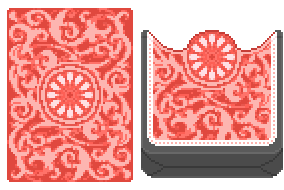
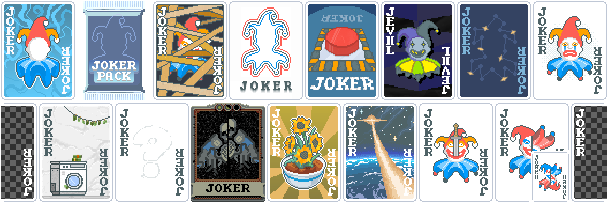

Shimmerberry is my personal mod that adds some vanilla-like/extending 
content to the game, including fun references to other games!

# Content
My silly mod currently adds:
- 3 Blinds (1 Boss Blind)
- 1 Deck with 1 respective [Card Sleeve](https://github.com/larswijn/CardSleeves)
- 15 Jokers

## Blinds

Click me to read up on my Blinds (in order)!

| Name | Description | Boss Blind? |
| ---- | ---- | ---- |
| The Pencil | Debuff first played card every hand | No |
| The Frog | -1 hand size and +1 discard for each hand played | No, it's just a tiny guy! |
| Ten Paces | If scored chips are between 80% and 100% of required chips, increase required chips by 10%  | Yes |

## Deck(s); Scartare Deck!

Start with a 32 Card "[Scartare Deck](https://en.wikipedia.org/wiki/Skat_(card_game))" (all ranks below 7 are missing): 
Start with 10 hand size and 0 discards. 
Discard 2 random cards with each hand played. 
(The Scartare-[Sleeve](https://github.com/larswijn/CardSleeves) works exactly the same!)

## Jokers

Click here to see all the relevant Joker information (in order)!

| Name | Description | Notes | Rarity |
| ---- | ---- | ---- | ---- |
| Abandoned Soul | This Joker gains X0.05 Chips every time a Playing card is destroyed | - | Rare |
| Booster Pack | 2 additional Booster Packs in each Shop | - | Common |
| Bound Joker | +4 Joker slots Disable and Destroy leftmost joker at beginning of round | Can be acquired with full Joker Slots | Uncommon |
| Echoing Joker | Create 1 Negative Copy of the next used Consumable | Enhanced by Probability-Buffs | Rare |
| Emergency Button | Prevents Death and Rerolls all Jokers and Consumables | - | Uncommon |
| JEV\]\[L | Generates a random Negative Consumable at beginning of round, 1 in 6 to replace it with a random "Joker" instead | Enhanced by Probability-Buffs | Legendary |
| Lost Constellation | 1 in 3 Planet cards upgrade hand 3 times | - | Uncommon |
| Misery | X0.5 Mult X2.0 Chips | - | Rare |
| Money Laundering | When Blind is selected, gain +2 Hands and +2 Discards Shops are Expensive | - | Uncommon |
| Mystery Joker? | Sell for a random Joker | Holds a Mystery! | - | Uncommon |
| Oblivion | -1 Ante when Boss Blind is defeated | Blinds still scale, but slower | Rare |
| Potted Flowers | Gains X0.15 Chips if poker hand contains a Diamond card, Club card, Heart card, and Spade card | - | Uncommon |
| Shooting Star | Upgrade every Poker Hand by 1 level when Boss Blind is defeated | Enhanced by Probability-Buffs | Uncommon |
| Sword Swallower | X1.0 Mult for each Common Joker | - | Rare |
| To n' Fro | Played cards swap Chips and Mult when scored Earn $1 every 11 swaps | - | Common |

# Download and Requirements
Click on "<> Code" and "Download ZIP", or just [Click Here](https://github.com/FlowireXen/Shimmerberry/archive/refs/heads/main.zip)! 
You also need:
- [Lovely](https://github.com/ethangreen-dev/lovely-injector)
- [Steamodded](https://github.com/Steamopollys/Steamodded)

# Credits and Shoutouts
- [Buffoonery](https://github.com/pinkmaggit-hub/Buffoonery) for being a great learning resource ^w^
- [Tetrapak](https://github.com/tetraminus/Tetrapak) for some ideas and getting me to create this mod :3

# Planned
- [Partner-API](https://github.com/Icecanno/Partner-API) Mod integration!~

# Thank you for reading
And I hope you enjoy my mod!

