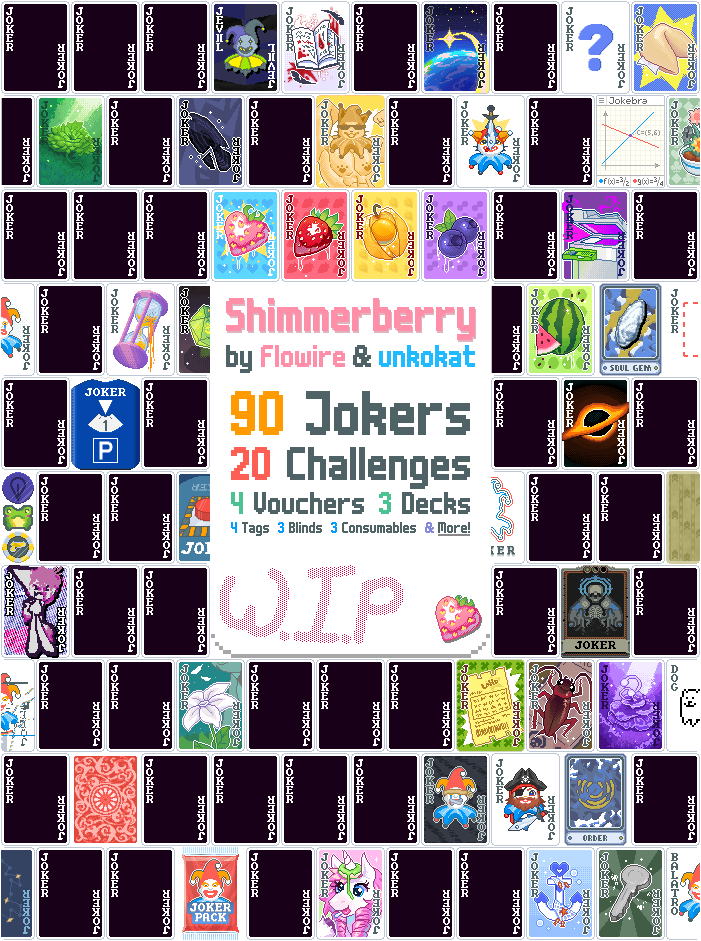

  
Welcome to <b>Shimmerberry</b>!

  

___
# Shimmerberry
Shimmerberry adds Custom, Fluffy and Vanilla-Like content:

- 90 Jokers
  > 34 Common  37 Uncommon  16 Rare  3 Legendary
- 20 Challenges
  > Including 4 Tutorials  and 2 Menageries
- 6 Skip-Tags
  > 2 Edition-Tags  2 Effect-Tags  2 Debt-Tags
- 3 Boss Blinds
  > Including 1 Showdown Blind
- 3 Decks
  > With <b>4</b> respective [Card Sleeves](https://github.com/larswijn/CardSleeves)
- 3 Consumables
  > 1 Tarot  2 Spectrals
- 2 Vouchers
  > With 2 Upgrades
- 3 Editions
  > For both Jokers and Cards

Programming by <ins>Flowire</ins>. 
Art by <ins>unkokat</ins> and <ins>Flowire</ins>.

# Download and Requirements
[Download Shimmerberry](https://github.com/FlowireXen/Shimmerberry/releases/latest) and get the latest release, or check out [all Releases](https://github.com/FlowireXen/Shimmerberry/releases).

Shimmerberry requires [Lovely](https://github.com/ethangreen-dev/lovely-injector) and [Steamodded](https://github.com/Steamodded/smods) to be installed, 
visit the [Steammodded Wiki](https://github.com/Steamodded/smods/wiki) to learn how to setup & install mods.

# Content
<!--Check out the [Modded Balatro Wiki](https://balatromods.miraheze.org/wiki/Shimmerberry) for detailed information!-->

### Jokers
<!-- Why did I decide to do this again? ;w; -->

Click to show: Jokers

### Joker Information
| Name | Effect | Cost | Rarity | Set |
| ---- | ---- | ---- | ---- | ---- |
| Blueberry | Each scored King or Queen gives +30 Chips Ranks change every round Gets Destroyed when Rank didn't score | $4 | Common | Berry, Food |
| Goldenberry | Each scored King or Queen earns $1 or $2 Ranks change every round Gets Destroyed when Rank didn't score | $5 | Uncommon | Berry, Food |
| Shimmerberry | Each scored King or Queen reduces Blind Size by 5% Ranks change every round Gets Destroyed when Rank didn't score this round | $6 | Rare | Berry, Food |
| Strawberry | Each scored King or Queen gives +8 Mult Ranks change every round Gets Destroyed when Rank didn't score | $5 | Uncommon | Berry, Food |
| Eternal Fortune | +1 Hand, +1 Luck | $4 | Common | - |
| Alpha | +1 Hand for first scoring Stone Card | $6 | Common | - |
| Anchor | X2 Chips Can't be Highlighted | $4 | Common | - |
| Booster Pack | 3 additional Booster Packs in each Shop Degrading | $5 | Common | - |
| Broken Record | Randomly add 2 to 3 retriggers to any scoring cards | $4 | Common | - |
| Buccaneer | Adds twice the sell value of all other owned Jokers to Chips (Currently +0 Chips) | $4 | Common | - |
| Butterfly | Gains +10 Chips if played hand contains a Pair, Loses 5 Chips if it doesn't (Currently +0 Chips) | $6 | Common | - |
| Coupon | Shops are 20% cheaper | $6 | Common | - |
| Fortune Cookie | Gains a new random Edition at the start of every Blind Sell this card to apply [This Edition] to a random Joker | $6 | Common | Food |
| Garden Gnome | +30 Mult -2 Hand size | $5 | Common | - |
| Incinerator | Increase amount of Discardable cards by 1 | $5 | Common | - |
| Lottery Ticket | Scoring numbered cards have a 1 in 4 chance to give +2.5 Mult or +12 Chips otherwise | $5 | Common | - |
| Mineshaft | Every 3 scoring cards, add a Stone, Steel or Gold card to the deck 50/50 uses left | $6 | Common | Repairable |
| Misery | X0.5 Mult X4 Chips for first hand of round | $5 | Common | - |
| Nashi Pear | When Blind is selected, increase Round score by 5000 and reduce this by 1000 | $3 | Common | Food |
| P2W | Spend $2 to gain +30 Mult | $4 | Common | - |
| P.E.T. | This Joker gains +2 Mult for every card discarded this round (Currently +0 Mult) | $5 | Common | - |
| Piggy Bank | X0.2 Mult for every $5 of sell value (Currently X1 Mult) When Blind is selected or skipped, spend $2 to add $1 of sell value | $5 | Common | - |
| Piñata | 1 in 5 chance to break open each hand played Gain +1 and fill all Consumable slots when Joker gets destroyed | $6 | Common | Food |
| Ripped Joker | +200 Chips if played hand contains 3 or fewer cards | $5 | Common | - |
| Risky Joker | Scoring cards take 4 Chips and 1 Mult and increase the Blind Payout by $1 (Next payout +$0) | $6 | Common | - |
| Silver Mask | Earn $20 at the end of the round Earn $2 less for each Hand size | $6 | Common | - |
| Stocked Shelves | +1 Booster pack, Card and Voucher slot in Shop | $4 | Common | - |
| Target Plush | +15 Chips for each Joker and +4 Mult for each empty Joker slot (+0 Chips, +0 Mult) | $6 | Common | - |
| Tempered Glass | Glass Cards have a 1 in 12 chance to be destroyed | $4 | Common | - |
| To n' Fro | Played cards swap Chips and Mult before scoring | $5 | Common | - |
| Axe | Each Spade card held in hand has a 20% chance to be destroyed Suit changes every round 80/100 uses left | $6 | Common | Tool, Repairable |
| Hoe | Each Spade card held in hand gives +20 Chips Suit changes every round 250/250 uses left | $5 | Common | Tool, Repairable |
| Pickaxe | Each Spade card held in hand has a 40% chance to give $2 Suit changes every round 200/200 uses left | $5 | Common | Tool, Repairable |
| Shovel | Each Spade card held in hand gives X1.2 Mult Suit changes every round 200/200 uses left | $6 | Common | Tool, Repairable |
| Toolkit | Jokers with a limited number of uses are repaired and regain up to 5 uses at the end of the round 500/500 uses left Can't be repaired | $4 | Common | Tool |
| Unicorn | +25 Chips for each unique Edition, Enhancement or Seal in your full deck (Currently +0 Chips) | $6 | Common | - |
| Warm Embrace | Chips and Mult are rounded up to the next multiple of 10 | $5 | Common | - |
| Abandoned Soul | Gains X0.1 Chips when a face card is destroyed (Currently X1 Chips) | $6 | Uncommon | - |
| Agent 47 | When discarding exactly 3 cards, eliminate one at random | $6 | Uncommon | - |
| Anodized Steel | Played Steel cards reduce the Blind Size by 7.5% when scored | $8 | Uncommon | - |
| Benthic Bloom | Retrigger all Enhanced Cards Enhanced Cards have a 1 in 4 chance to shatter like Glass Possessive | $6 | Uncommon | - |
| Bound Joker | Debuff and Destroy leftmost joker that isn't Debuffed at beginning of round +4 Joker slots | $8 | Uncommon | - |
| Chrono Break | Revive shattered playing cards Shatter a random scoring card each hand | $7 | Uncommon | - |
| Cockroach | +1 Ante when Boss Blind is defeated Possessive | $6 | Uncommon | - |
| Coupon Booklet | Shops are 50% cheaper Raise prices by 10% on every Reroll | $6 | Uncommon | - |
| Emergency Button | Prevents Death and Rerolls all Jokers and Consumables, unless the cause is running out of cards | $6 | Uncommon | - |
| 57 Leaf Clover | Retrigger all Wild Cards 3 times | $8 | Uncommon | - |
| Gold Bomb | Destroy all played cards in final hand of round | $5 | Uncommon | - |
| Goobert | Creates imperfect copies of playing cards added to your deck 10/10 uses left | $8 | Uncommon | Repairable |
| Info Board | Your Joker arrives in: +20 Mult | $7 | Uncommon | Hypetrain |
| Hypetrain | Level X1! Next stop in: +20 Mult | $7 | Uncommon | Hypetrain |
| Jokebra | When Blind is selected, set an additional Target (Between 100 and 1100) Beat the Blind when the Round score matches the Target | $8 | Uncommon | - |
| Lost Constellation | 1 in 3 Planet cards upgrade poker hand 2 additional times | $6 | Uncommon | - |
| Melon | When Blind is selected, reduce Blind Size by 50% Destroyed when Boss Blind is defeated | $6 | Uncommon | Food |
| Money Laundering | When Blind is selected, gain +2 Hands and +2 Discards Shop prices increase by 100% | $9 | Uncommon | - |
| Obscure Ritual | Reduce Blind Size by 50% when drawing the last card | $5 | Uncommon | - |
| Opulent Skint | Generate an extra Joker in the Shop The less Money you have, the Rarer the Joker | $5 | Uncommon | - |
| Parking Disc | Effect changes each round, Bonus Effect in Boss Blinds | $6 | Uncommon | Parking Disc\* (See below) |
| Perfect Pitch | X2 Mult when scoring exactly 2 card(s) (Amount changes every hand) Gain X1 Mult after 5 successful hands in a row (Currently 0/5) | $6 | Uncommon | - |
| Plastic Key | Destroy this card and create 2 Spectral cards when Boss Blind is defeated (Must have room) | $6 | Uncommon | - |
| Potted Flowers | Gains X0.2 Chips if poker hand contains a Diamond card, Club card, Heart card, and Spade card (Currently X1 Chips) | $6 | Uncommon | - |
| Quest? | Start a Quest! Complete it to Win the Game and obtain a random Legendary Joker | $7 | Uncommon | Quest\* (See below) |
| Red Lion | X2.5 Mult Loses X0.1 Mult for each Enhanced card in your deck | $6 | Uncommon | - |
| Red Mask | This Joker gains +8 Chips when adding or removing a playing card (Currently +0 Chips) | $6 | Uncommon | - |
| Scaffolding | +/-0 Hand size When Blind is selected gain 1 Hand size for every other Joker Lose 3 Hand size each Hand played | $5 | Uncommon | - |
| 7 Wonders | When Blind is selected reduce the Blind Size by 2% for each 7 in your full deck (Currently 0%/50%) | $7 | Uncommon | - |
| Shooting Star | When Boss Blind is defeated, upgrade every Poker Hand by 1 level(s) | $7 | Uncommon | Luck affected |
| Stern Teacher | When Blind is selected, Debuff adjacent Jokers +25 Mult for each Debuffed Joker (Currently +0 Mult) | $5 | Uncommon | - |
| Stylish Joker | -1 hand size +2 consumable slots Earn $1 for every Consumable you keep at the end of round | $5 | Uncommon | - |
| PUSH UR T3MPRR | BLIND SELECTED, CLOCK IT UP 200% CARD PLAYED, PUSH IT DOWN 6% | $5 | Uncommon | - |
| The Dwarf | When Blind is selected, set hand size to 5 and add the difference to the Discards | $6 | Uncommon | - |
| The Giant | When Blind is selected, lose all discards and gain as much hand size | $6 | Uncommon | - |
| Watching Forest | Sort the Deck lowest to highest every 3 hands played | $5 | Uncommon | - |
| Adblocker | When Blind is selected, debuff a random suit in your deck (Debuffed: Nothing) Played debuffed cards give $2 before scoring | $8 | Rare | - |
| Annoying Dog | X3.0 Mult No consumable slots | $7 | Rare | - |
| Ceaseless Void | This Joker gains a random upgrade for each Joker sold When Blind is selected increase Blind Size by 0% +20 Chips, X1 Chips +0 Mult, X1 Mult Earn $0 at end of round | $9 | Rare | - |
| Common Denominator | Copies abilities of all Common Jokers | $10 | Rare | - |
| Copy Printer | At the end of the Shop convert the Joker to the left into the Joker to the right (Destroyed after use) | $12 | Rare | - |
| Echoing Joker | Create 2 Negative copies of the next used Consumable | $12 | Rare | Luck affected |
| Hemoturgy | Discarded cards gain a random Edition, Enhancement or Seal -1 Discard each round Decreases amount of Discardable Cards by 2 | $7 | Rare | - |
| Improv Show | Spend 1 Discard each hand played to regain 1 Hand Earn $1 less per remaining Hand | $8 | Rare | - |
| Lavish Joker | Regain lost Money Each $1 regained increases the next Blind Size by 5% (Next Blind: +0%) Turns Possessive after $20 regained | $1 | Rare | - |
| Ouroboros | Each scored 8 gives +1 Hand and increases the Blind Size by 8% | $8 | Rare | - |
| Pocket Dimension | Cards in your Consumable area give X1.5 Mult +3 consumable slots | $8 | Rare | - |
| Singularity | Create a copy of every scoring card When this Joker gets removed, Destroy all cards it has created Occupies 3 Joker slots | $10 | Rare | - |
| Sword Swallower | X1 Mult for each Common Joker (Currently X1 Mult) | $8 | Rare | - |
| 20 to Die for | Quadruples all listed probabilities (ex: 1 in 3 -> 4 in 3) | $6 | Rare | - |
| TMTRAINER | Randomizes most Numbers on newly obtained Jokers Range: 35%-255% +1 Joker slot | $9 | Rare | TMTRAINER'd |
| Afterimage | Copies ability of Joker to the left 3 times | $20 | Legendary | - |
| JEV\]\[L | Occupies the Consumable-Area +3 consumable slots Using a Consumable Degrades and Copies another Consumable in your possession (Must have room) | $20 | Legendary | - |
| Oblivion | You can't Up the Ante, Win after 40 Loops Gain Progress by defeating Blinds, reaching 100% allows you to Up the Ante Difficulty rises with each Hand played, each Card discarded or each Blind skipped | $20 | Legendary | - |

### Parking Disc States
| State | Effect | Note |
| ---- | ---- | ---- |
| X | Initial State | Excluded from State 12 |
| 1 | +1 Handsize | - |
| 2 | X2 Mult | - |
| 3 | Copies ability of Joker to the left 2 times | "Compatible"/"Incompatible" visible in State 3 and 12 |
| 4 | +1 Discard(s) | - |
| 5 | Scoring cards give +5 Mult | - |
| 6 | Create 1 Consumable(s) each hand played (Must have room) | - |
| 7 | X3 Chips | - |
| 8 | Earn $4 each each hand played | - |
| 9 | Reduce Blind Size by 5% each hand played | - |
| 10 | +100 Chips | - |
| 11 | Retrigger all scoring cards 1 time(s) | - |
| 12 | Random State with Bonus State | Excluded from State 12 |
| B1 | 2x Effectiveness | Boss Bonus |
| B2 | Additional Hands | Boss Bonus |
| B3 | Reduce Blind Size | Boss Bonus |
| B4 | Disable Boss Blind | Boss Bonus Excluded from State 12 |

### Quests!
| Name | Quest | Active | Difficulty |
| ---- | ---- | ---- | ---- |
| Honest Work | Play 60 Hands | Always Active | Easy |
| The Nail | Beat 6 Blinds in a row with only One Hand played | Active until Failed Resets next Blind | Hard |
| Super Speed | Play 8 Hands in One Blind | Active in Blinds | Hard |
| Pollution | Discard 250 Cards | Always Active | Easy |
| The Anchor | Beat 9 Blinds in a row without Discarding any cards | Active until Failed Resets next Blind | Medium |
| Anarchy | Discard 30 Cards in One Blind | Active in Blinds | Hard |
| Obliged Debt | Spend $300 | Always Active | Easy |
| The Claw | Beat 6 Blinds in a row without spending or losing any Money | Active until Failed Resets next Blind | Hard |
| Big Bounty | Earn $100 in One Blind | Active in Blinds | Medium |
| Consumerism | Use 100 Consumables | Always Active | Easy |
| The Incentive | Beat 12 Blinds in a row without using any Consumables | Active until Failed Resets next Blind | Medium |
| Bullet Time | Use 10 Consumables in One Blind | Active in Blinds | Hard |
| Heartbeat | Skip 25 Buffoon Packs | Always Active | Medium |
| The Soul | Beat 6 Blinds in a row without adding or selling any Jokers | Active until Failed Resets next Blind | Hard |
| Final Hunt | Sell 8 Jokers in One Blind | Active in Blinds | Hard |

### Challenges

Click to show: Challenges

### Page 1 (1-10)
| Name | Type | Short Challenge Summary |
| ---- | ---- | ---- |
| A Berry Good Meal | Tutorial | Shows how the "Berry Jokers" interact. Limited Economy, lowered Winning Ante. |
| A Tool for every Joke | Tutorial | Shows how the "Tool Jokers" interact. Limited Economy, lowered Winning Ante. |
| Perishable Fate | Challenge | All Jokers are Degrading. Degrading: Destroyed after 5 rounds. |
| Countdown | Challenge | Don't regain used Hands or Discards. |
| Shiny Hunt | Challenge | Increased chance for the Shiny Edition. Eternal Dagger, increased Winning Ante. |
| Hunter | Challenge | Start with Agent 47, reduce your Deck to Win. Custom Win Condition, no Showdowns. |
| Hunted | Challenge | Start with Agent 47, keep your Deck high to Win.  Decreased Hand size and Discardable amount. |
| Done Deal | Challenge | Start with 1 Stone Card. Limited Economy, starting Jokers help re-building a Deck. |
| The Last Unicorn | Challenge | Destroy your starting Joker. Custom Win Condition, no Showdowns. |
| The Menagerie | Menagerie | Multiplies Blind size by current Ante. |

### Page 2 (11-20)
| Name | Type | Short Challenge Summary |
| ---- | ---- | ---- |
| Printty Good | Tutorial | Shows how "Copy Printer" works. Limited Economy, lowered Winning Ante. |
| Gaokao | Tutorial | Shows how "Jokebra" works. <b>Impossible</b> Score-Requirements. |
| Lavish Dreams | Challenge | Unlimited Money? X4.0 Blind Scaling. |
| 50 uses left | Challenge | Lose when out of Money. Pay for leftover Hands and Discards. |
| Parking Roulette | Challenge | Start with 5x "Parking Disc". |
| Qwest? | Challenge | Start with a random Quest! Custom Win Condition, no Showdowns. |
| Emperor Calus | Challenge | Start with debt. No Jokers in Shop. |
| Last One Left | Challenge | Wild Kings but no Baron. <b>Higher</b> Winning Ante! |
| Speed of Light | Challenge | Start with better Poker Hands. Increased Blind Scaling,  <b>Doubled</b> Winning Ante! |
| Grandmaster Menagerie | Menagerie | Multiplies Blind size by current Ante. Applies Gold Stake difficulty. |

### Skip-Tags

Click to show: Skip-Tags

| Name | Description | Trigger |
| ---- | ---- | ---- |
| Intimidating Tag | -10% Blind Size next round | Start of Blind |
| Pearlescent Tag | Next base edition shop Joker is free and becomes Pearlescent | Shop-Item |
| Shiny Tag | Next base edition shop <i>Consumable</i>  is free and becomes Shiny | Shop-Item |
| Vouch-down Tag | Reduce the cost of a random Voucher by $5 next shop | Start of Shop |

| Name | Description | Trigger | Source |
| ---- | ---- | ---- | ---- |
| Lavish Debt\* | +50% Blind Size next round  Percentage based on Source-Conditions | Start of Blind | Created by <i>Lavish Joker</i> after being sold. |
| Resonance Debt\* | +25% Blind Size next round  Percentage based on Source-Conditions | Start of Blind | Created by <i>Resonance</i> after each blind. |

\* Debt-Tags don't trigger Double-Tag!

### Boss Blinds

Click to show: Boss Blinds

| Name | Description | Showdown? |
| ---- | ---- | ---- |
| Sharp Shooter | Five random cards debuffed every hand. | Yes |
| The Frog | -1 hand size and +1 discard for each hand played. | No, it's just a tiny guy! |
| The Pencil | Debuff first played card every hand. | No |

### Decks (& Sleeves)

Click to show: Decks (& Sleeves)

| Name | Description | Deck + Sleeve |
| ---- | ---- | ---- |
| Hopeless Deck | Unknown Winning Ante. Gain +1 Joker Slot every 4 Boss Blinds defeated. | Increases Winning Ante, but gain the bonus Slot quicker. |
| Scartare Deck | Remove all Ranks below "7". +2 Hand size, -3 Discards. Discard 2 random cards with each hand played. | +2 Hand Size. Discard 2 additional cards with each hand played. |
| Strange Deck | "Generating Deck..." Randomized Starter-Deck, Cards change over time... | "Generating Sleeve..." Blind Sizes and Shop Prices change over time... |
| Burned Sleeve | No Deck, just a Challenge Sleeve! | Destroy the first drawn hand every Boss Blind. |

### Consumables

Click to show: Consumables

| Name | Description | Type |
| ---- | ---- | ---- |
| Ocean | Add Pearlescent or Shiny to either one Playing Card or a random Joker. | Tarot |
| Order | Replace all Jokers with one random Joker in your possession, the new copies keep their old Modifiers. | Spectral |
| Soul Gem | Captures the <i>Soul</i> of defeated Blinds. | Spectral |

### Vouchers

Click to show: Vouchers

| Base Name | Base Description | Upgrade Name | Upgrade Description | Total | 
| ---- | ---- | ---- | ---- | ---- |
| Comedy Mask | Reduce all Blind Sizes by 10% -1 Hand size. | Tragedy Mask | Reduce all Blind Sizes by 15% -1 Hand size. | -25% Blind size -2 Hand size |
| Old Urn | Permanently increase amount of Discardable cards by 1. | Cursed Urn | Permanently increase amount of Discardable cards by 2, but lose 1 Discard each round. | +3 Discardable cards -1 Discard each round |

### Editions

Click to show: Editions

| Name | Joker Description | Card Description |
| ---- | ---- | ---- |
| Pearlescent | Reduce Blind Size by 5% | <small>(No Difference)</small> |
| Resonance | +1 Area Slot, Can't be Debuffed. Each Resonance increases next Blind Sizy by 25% | <small>(No Difference)</small> |
| Shiny | Gains $3 of sell value at end of round. | Grant $1 of sell value to a random Joker. |

### Stickers

Click to show: Stickers

| Name | Effect | Source | Technical Note |
| ---- | ---- | ---- | ---- |
| Event Horizon | Destroyed when it's Singularity is removed | "Singularity"-Joker. | Purely Visual. |
| Degrading | Destroyed after 5 rounds. | Inherent Ability, "JE\]\[L"-Joker or in Challenges | - |
| Possessive | Can't be sold. | Inherent Ability or in Challenges | - |
| TMTRAINER'd | Shows "Change"- Multiplier. | "TMTRAINER"-Joker or in Challenges | Purely Visual. |

# Art-Credits \& Shoutouts
All the amazing Art was made by: 
<ins><b>unkokat</b></ins>: [Ko-fi](https://ko-fi.com/unkokat), [X.com](https://x.com/unkokat)18+ 

Inspired me to start Modding: 
<ins><b>Buffoonery</b></ins>: [GitHub-Page](https://github.com/pinkmaggit-hub/Buffoonery) 
<ins><b>Tetrapak</b></ins>: [GitHub-Page](https://github.com/tetraminus/Tetrapak) 

<!--
# Other Mod Pages
Coming soon! 
-> Curseforge, Nexus, etc. ...
-->

# Thank you for reading
and we hope <i>You</i> will enjoy our mod! 
 
\- Flowire, unkokat

___
# License
Shimmerberry is licensed under the [GNU General Public License (GPL-3.0)](https://www.gnu.org/licenses/gpl-3.0.en.html#license-text).

___
# TL;DR
Shimmerberry's main Additions: 
<b>90</b> Jokers, <b>20</b> Challenges, 
<b>3</b> Blinds, <b>3</b> Consumables and <b>3</b> Decks. 
Go [Download Shimmerberry](https://github.com/FlowireXen/Shimmerberry/releases/latest), 
you also need [Lovely](https://github.com/ethangreen-dev/lovely-injector) and [Steamodded](https://github.com/Steamodded/smods).
