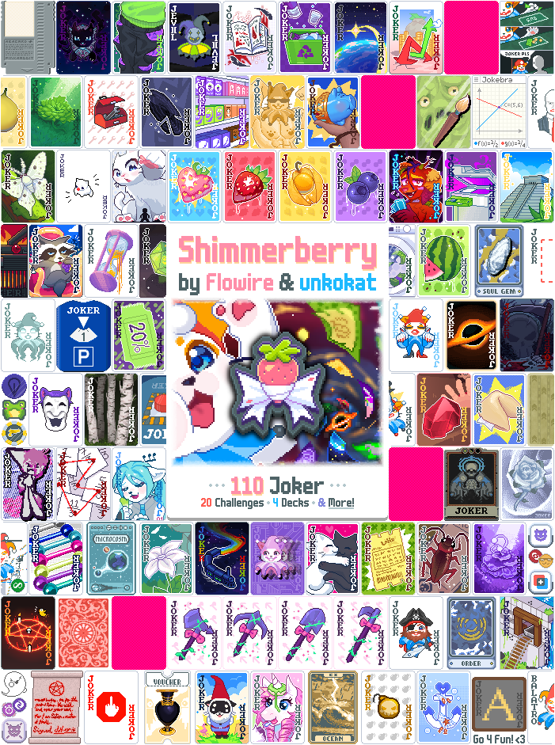

  
Welcome to <b>Shimmerberry</b>!

  

___
# Shimmerberry
Shimmerberry adds Custom, Fluffy and Vanilla-Like content:

- 110 Jokers
- 20 Challenges
- 11 Skip-Tags
- 7 Consumables
- 7 Stickers
- 5 Boss Blinds
- 4 Decks (And <b>4</b> [Card Sleeves](https://github.com/larswijn/CardSleeves))
- 2 Vouchers
- 3 Editions
- 2 Enhancements
- Custom Achievements

Programming by <ins>Flowire</ins>. 
Art by <ins>unkokat</ins> and <ins>Flowire</ins>.

Guest-Art by; 
<ins>lanedarushpy</ins> and <ins>GhostSalt</ins>.

# Download and Requirements
[Download Shimmerberry](https://github.com/FlowireXen/Shimmerberry/releases/latest) and get the latest release, or check out [all Releases](https://github.com/FlowireXen/Shimmerberry/releases).

Shimmerberry requires [Lovely](https://github.com/ethangreen-dev/lovely-injector) and [Steamodded](https://github.com/Steamodded/smods) to be installed, 
visit the [Steammodded Wiki](https://github.com/Steamodded/smods/wiki) to learn how to setup & install mods.

# Content

#### Check out the [Shimmerberry Wiki](https://balatromods.miraheze.org/wiki/Shimmerberry) for detailed information,

<b>or Click here to read up on all the avaliable Content!</b>

## Jokers
<!-- Why did I decide to do this again? ;w; -->
<!-- Because We love to proof others Wrong! -->

Click to show: Jokers

### Joker Information
| Name | Effect | Cost | Rarity | Properties |
| ---- |:------:|:----:| ------ | ---------- |
| Flower Pot | X4 Mult if poker hand contains 4 different suits | $6 | Rare | Nature, Vanilla |
| Abandoned Soul | Gains X0.2 Chips when a face card is destroyed (Currently X1 Chips) | $6 | Uncommon | -- |
| A.C.E. | Add the next 1 to 5 playing cards from Deck to scoring hand | $7 | Rare | -- |
| Adblocker | When Blind is selected, Debuff a random suit in your deck (Debuffed: [Suit]) Played debuffed cards give $2 before scoring | $8 | Rare | -- |
| Afterimage | Copies ability of Joker to the left 3 times | $20 | Legendary | -- |
| Agent 47 | When discarding exactly 3 cards, eliminate one at random | $6 | Uncommon | -- |
| Alpha | +1 Hand for first scoring Stone Card | $6 | Common | Magic |
| Anchor | X2 Chips Can't be Highlighted | $4 | Common | Ocean |
| Annoying Dog | X3.0 Mult No consumable slots | $7 | Rare | Animal |
| Anodized Steel | Played Steel cards reduce the Blind Size by 5% when scored | $8 | Uncommon | -- |
| Axe | Each [Suit] card held in hand has a 20% chance to be destroyed Suit changes every round 80/100 uses left | $6 | Common | Durability |
| Balloon | X2 Mult Self destructs when highlighting 4 or more cards | $4 | Common | -- |
| Barmy Joker | +12 Mult if poker hand contains 3 different suits | $5 | Common | -- |
| Benthic Bloom | Retrigger all Enhanced Cards Enhanced Cards have a 1 in 4 chance to shatter like Glass Possessive | $6 | Uncommon | Nature |
| Blueberry | Each scored [King] or [Queen] gives +30 Chips Ranks change every round Gets Eaten when no [King] or [Queen] scored this round | $4 | Common | Berry, Food |
| Booster Pack | 3 additional Booster Packs in each Shop 3/3 uses left | $5 | Common | Durability |
| Bound Joker | When obtaining or destroying this card, apply Bound to 3 random Jokers | $6 | Uncommon | -- |
| Broken Record | Randomly add 2 to 3 retriggers to any scoring cards | $4 | Common | Music |
| Buccaneer | Adds thrice the sell value of all other owned Jokers to Chips (Currently +0 Chips) | $4 | Common | -- |
| Bunburrow | Gain $12 every 4 Rerolls (4 remaining) | $4 | Common | Animal |
| Butterfly | 0 Chips Gains +8 Chips if played hand contains a Pair, Loses 4 Chips if it doesn't | $6 | Common | Animal |
| Cassette Beast | Retrigger scoring cards for each scoring suit | $8 | Rare | Animal, Music |
| Ceaseless Void | When a Card is sold, gain +3% Blind Size, X0.02 Mult or X0.02 Chips for each $1 of sell value When Blind is selected increase Blind Size by 0% X1 Chips, X1 Mult | $8 | Rare | Animal, Space |
| Chrono Break | Revive shattered playing cards Shatter all scoring cards each hand | $7 | Rare | Magic, Music |
| Cockroach | +1 Ante when Boss Blind is defeated Possessive | $6 | Uncommon | Animal |
| Common Denominator | Copies abilities of all Common Jokers Commons: 0 Compatible: 0 Incompatible: 0 | $10 | Rare | -- |
| Copy Printer | At the end of the Shop convert the Joker to the left into the Joker to the right (Conditional self destruct) | $12 | Rare | -- |
| Coupon | Shops are 20% cheaper | $6 | Common | -- |
| Coupon Booklet | Shops are 50% cheaper Raise prices by 10% on every Reroll | $6 | Uncommon | -- |
| Daffy Joker | +8 Mult if poker hand contains 2 different suits | $5 | Common | -- |
| DATAMINER | Changes most Numbers on newly obtained Jokers by X0.5 or X2 | $7 | Uncommon | -- |
| Digitizon | When Blind is selected, take $1 of sell value from every Joker and Consumable card Create a Memory card for every $3 taken ($3 remaining) | $6 | Uncommon | Animal |
| Doomsday Device | Double the stored Memory Value every 20 scoring Memory Cards (Currently 0/20) | $6 | Uncommon | -- |
| Echoing Joker | Create 2 Negative copies of the next used Consumable (Probability affected) self destructs | $8 | Rare | -- |
| Eden's Blessing | X1.5 Chips or Mult, favours the small Grants a Brighter Future when Boss Blind is defeated | $4 | Uncommon | Nature |
| Emergency Button | Prevents Death and Rerolls all Jokers and Consumables | $6 | Uncommon | -- |
| Eternal Fortune | +1 Hand, +1 Luck | $4 | Common | Nature |
| 57 Leaf Clover | Retrigger all Wild Cards 3 times | $8 | Uncommon | Nature |
| Fire Exin't | Reduce Shop prices by 1% every played and unscored card, resets when Boss Blind is selected (Currently 0%/50%) | $6 | Uncommon | -- |
| Fortune Cookie | Gains a new random Edition at the start of every Blind Sell this card to apply (This Edition) to a random Joker | $6 | Common | Food |
| Fox Plush | +12 Chips for each Joker and +5 Mult for each empty Joker slot (+0 Chips, +0 Mult) | $6 | Common | Animal |
| Gambler's Contract | Shop Jokers have a 1 in 13 chance to become Negative and a 2 in 13 chance to become Possessive (Fixed probabilities) | $7 | Rare | -- |
| Garden Gnome | +30 Mult -2 Hand size | $5 | Common | -- |
| Gold Bomb | Destroy all played cards in final hand of round | $5 | Uncommon | -- |
| Goldenberry | Each scored [King] or [Queen] earns $1-$2 Ranks change every round Gets Eaten when no [King] or [Queen] scored this round | $5 | Uncommon | Berry, Food |
| Goobert | Creates imperfect copies of playing cards added to your deck 10/10 uses left | $8 | Uncommon | Durability |
| Hemoturgy | Discarded cards gain a random Edition, Enhancement or Seal -2 Discard Limit | $7 | Rare | Magic |
| Hoe | Each [Suit] card held in hand gives +25 Chips Suit changes every round 250/250 uses left | $5 | Common | Durability |
| Hypetrain (Info Board) | Level X1! Next stop in: +20 Mult | $7 | Uncommon | -- |
| Improv Show | Converts unused Hands into Points at end of round When playing your final hand, convert 1 Point into 1 Hand Stored: 0 Points (Next point: 0%) | $8 | Rare | -- |
| Incinerator | +1 Discard Limit | $5 | Common | -- |
| Inven-Tation | Vintage Cards have a 1 in 8 chance to upgrade the played poker hand | $5 | Uncommon | -- |
| JEV][L | Played Playing Cards evaluate twice | $20 | Legendary | -- |
| Jokebra | When Blind is selected, set an additional Target (Between 100 and 1000) Beat the Blind when the Round score matches the Target | $8 | Uncommon | -- |
| Lavish Joker | Regain lost Money at start of shop (Currently $0) Each $1 regained increases the next Blind Size by 5% (Currently +0%) | $0 | Rare | -- |
| Lost Constellation | 1 in 3 Planet cards upgrade poker hand 2 additional times | $6 | Uncommon | Space |
| Lottery Ticket | Scoring non-face cards have a 1 in 4 chance to give +2.5 Mult or +12 Chips otherwise | $5 | Common | -- |
| Melon | When Blind is selected, reduce Blind Size by 50% Destroyed when Boss Blind is defeated | $6 | Uncommon | Food |
| Mineshaft | Every 3 scoring cards, add a Stone, Steel or Gold card to the deck (Currently 0/3) 50/50 uses left | $6 | Common | Durability |
| Misery | X0.5 Mult X4.0 Chips for first hand of round | $5 | Common | -- |
| Money Laundering | When Blind is selected, gain +2 Hands and +2 Discards Increase shop prices by 100% | $9 | Uncommon | -- |
| Nashi Pear | When Blind is selected, increase Round score by 10.000 and reduce this by 2000 | $3 | Common | Food |
| Oblivion | When beating Ante 1+ Loop back to Ante 1 Every Loop increases all Blind Sizes by 50% (Currently +0%) Every Loop increases Boss payouts by $3 (Currently $0) | $20 | Legendary | -- |
| Obscure Ritual | Reduce Blind Size by 66.6 when drawing the last card | $5 | Uncommon | Magic |
| Opulent Skint | Sell this card to replace a random card in the Shop with this Joker 1 in 256 chance to transform into a Legendary Joker when Bought | $10 | Uncommon | Animal |
| Ouroboros | Each scored 8 gives +1 Hand and increases the Blind Size by 8% | $8 | Rare | Animal |
| Paper Swan | X2 Chips every 5 scoring cards (Currently 0/5) | $5 | Common | Animal |
| Parking Disc | Effect changes each round, Bonus Effect in Boss Blinds | $6 | Uncommon | Multistage* |
| Peculiar Joker | +100 Chips if poker hand contains 3 different suits | $5 | Common | -- |
| Perfect Pitch | X2 Mult when scoring exactly [1-5] card(s) (Changes every hand) Gain X1 Mult after 5 successful hands in a row (Currently 0/5) | $6 | Uncommon | Music |
| P.E.T. | This Joker gains +2 Mult for every card discarded this round (Currently +0 Mult) | $5 | Common | -- |
| Pickaxe | Each [Suit] card held in hand has a 40% chance to give $2 Suit changes every round 200/200 uses left | $5 | Common | Durability |
| Piggy Bank | When Blind is selected or skipped, spend $2 to add $1 of sell value Starts with $2 extra sell value X0.2 Mult for every $4 of sell value (Currently X1 Mult) | $5 | Common | Animal |
| Piñata | 1 in 5 chance to break open each hand played Gain +1 permanent Consumable slot and fill all Consumable slots when Joker gets destroyed | $6 | Common | Animal, Food |
| Plastic Key | Destroy this card and create 2 Spectral cards when Boss Blind is defeated (Must have room) | $6 | Uncommon | -- |
| Pocket Dimension | Cards in your Consumable area give X1.5 Mult +3 Consumable slots | $8 | Rare | Magic, Space |
| Potted Flower | X4 Chips if poker hand contains 4 different suits | $6 | Uncommon | Nature |
| P2W | Spend $2 to gain +30 Mult each Hand | $4 | Common | -- |
| PUSH UR T3MPRR | BLIND SELECTED, CLOCK IT UP 200% CARD PLAYED, PUSH IT DOWN 6% | $5 | Uncommon | Animal, Music |
| Pygmymall | +2 card slots available in shop every 3 shops In 3 shops | $6 | Uncommon | -- |
| Quest? | Start a Quest! Complete it to Win the Game and obtain a random Legendary Joker | $7 | Uncommon | Multistage* |
| Red Lion | X2.5 Mult Loses X0.1 Mult for each Enhanced card in your deck | $6 | Uncommon | -- |
| Red Mask | This Joker gains +10 Chips when adding or removing a playing card (Currently +0 Chips) | $6 | Uncommon | -- |
| Replicator  | Destroys the next 20 played cards to Duplicate the rightmost Joker self destructs (Currently 0/20) | $6 | Rare | -- |
| Ripped Joker | +100 Chips if played hand contains 3 or fewer cards | $5 | Common | -- |
| Risky Joker | Scoring cards take 6 Chips and 2 Mult and increase the Blind Payout by $1 (Next payout +$0) | $6 | Common | -- |
| Scaffolding | 0/5 Hand size When a Joker is sold, gain +1 Hand size for each $1 of sell value Lose 2 Hand size each Hand played | $5 | Uncommon | -- |
| Scav. Prototype | When Blind is selected, destroy adjacent Jokers 1 in 4 chance to gain a Duplitage for each destroyed Joker | $5 | Uncommon | Animal |
| 7 Wonders | When Blind is selected reduce the Blind Size by 2% for each 7 in your full deck (Currently 0%/50%) | $7 | Uncommon | -- |
| Shimmerberry | Each scored [King] or [Queen] reduces Blind Size by 5% Ranks change every round Gets Eaten when no [King] or [Queen] scored this round | $6 | Rare | Berry, Food |
| Shooting Star | When Boss Blind is defeated, upgrade every Poker Hand by 1 level(s) (Probability affected) | $7 | Uncommon | Space |
| Shovel | Each [Suit] card held in hand gives X1.2 Mult Suit changes every round 200/200 uses left | $6 | Common | Durability |
| Shrewd Joker | +50 Chips if poker hand contains 2 different suits | $5 | Common | -- |
| Silver Mask | Earn $2 each missing Hand size below 10 at the end of the round (Currently +$20) | $6 | Common | -- |
| Singularity | Create a copy of every scoring card without an Event Horizon sticker When this Joker gets removed, Destroy all cards it has created (Can't be Debuffed) Occupies 3 Joker slots | $10 | Rare | Space |
| Stern Teacher | When Blind is selected, Debuff adjacent Jokers for the current round +25 Mult for each Debuffed Joker (Currently +0 Mult) | $5 | Uncommon | -- |
| Stocked Shelves | Restocks bought Booster Packs, Cards and Vouchers in Shop 8/8 uses left | $4 | Common | Durability |
| Strawberry | Each scored [King] or [Queen] gives +8 Mult Ranks change every round Gets Eaten when no [King] or [Queen] scored this round | $5 | Uncommon | Berry, Food |
| Stylish Joker | Earn $1 for every Consumable you keep at the end of round +2 consumable slots and -1 hand size | $5 | Uncommon | -- |
| Sword Swallower | X1 Mult for each Common Joker (Currently X1 Mult) | $8 | Rare | -- |
| Tempered Glass | Every played Glass Card permanently decreases the chance of breaking by 2 when scored (ex: 1 in 4 -> 1 in 6) | $4 | Common | -- |
| The Dwarf | When Blind is selected, set hand size to 5 and add the difference to the Discards | $6 | Uncommon | Animal |
| The Giant | When Blind is selected, lose all discards and gain as much hand size | $6 | Uncommon | Animal |
| TMTRAINER | Randomizes most Numbers on newly obtained Jokers Range: -15%-255% +1 Joker slot | $9 | Rare | -- |
| To n' Fro | Played cards swap Chips and Mult before scoring | $5 | Common | -- |
| Toolkit | All Jokers to the left, that have a limited number of uses, are repaired and regain up to 5 uses at the end of the round 200/200 uses left Can't be repaired | $4 | Common | Durability |
| 20 to Die for | Quadruples all listed probabilities (ex: 1 in 3 -> 4 in 3) | $6 | Rare | Magic |
| Unicorn | +20 Chips for each unique Edition, Enhancement or Seal in your full deck (Currently +0 Chips) | $6 | Common | Animal, Magic |
| V.I.P. Ticket | Bonus Cards always shuffle to the top of the Deck | $5 | Common | -- |
| Warm Embrace | Chips and Mult are rounded up to the next multiple of 10 | $5 | Common | Animal |
| Watching Forest | Sort the Deck lowest to highest after drawing the first hand each round Change sort order every 3 hands played 2 remaining | $6 | Rare | Nature |

### Parking Disc
#### Main States
| State | Effect |
|:-----:|:------:|
| 0, ? | Effect changes each round, Bonus Effect in Boss Blinds |
| 1 | +1 Handsize |
| 2 | X2 Mult |
| 3 | Copies ability ofJoker to the left 2 times |
| 4 | +1 Discard(s) |
| 5 | Scoring cards give +5 Mult |
| 6 | Create 1 Consumable(s) each hand played (Must have room) |
| 7 | X3 Chips |
| 8 | Earn $4 each each hand played |
| 9 | Reduce Blind Size by 10% each hand played |
| 10 | +100 Chips |
| 11 | Retrigger all scoring cards 1 time(s) |
| 12 | Unknown Effect with Bonus Effect |
#### Bonus States
| State | Effect | Note |
|:-----:|:------:| ---- |
| B1 | 2x Effectiveness | -- |
| B2 | Additional Hands | +2 Hands |
| B3 | Reduce Blind Size | -25% |
| B4 | Disable Boss Blind | -- |

### Quest?
| Type | Name | Quest | Active |
|:----:| ---- |:-----:| ------ |
| Hands | Honest Work | Play 60 Hands | Always Active |
| Hands | The Nail | Beat 6 Blinds in a row with only One Hand played | Active until Failed Resets next Blind |
| Hands | Super Speed | Play 8 Hands in One Blind | Active in Blinds |
| Discards | Pollution | Discard 250 Cards | Always Active |
| Discards | The Anchor | Beat 9 Blinds in a row without Discarding any cards | Active until Failed Resets next Blind |
| Discards | Anarchy | Discard 30 Cards in One Blind | Active in Blinds |
| Money | Obliged Debt | Spend $300 | Always Active |
| Money | The Claw | Beat 6 Blinds in a row without spending or losing any Money | Active until Failed Resets next Blind |
| Money | Big Bounty | Earn $100 in One Blind | Active in Blinds |
| Consumables | Consumerism | Use 100 Consumables | Always Active |
| Consumables | The Incentive | Beat 12 Blinds in a row without using any Consumables | Active until Failed Resets next Blind |
| Consumables | Bullet Time | Use 10 Consumables in One Blind | Active in Blinds |
| Jokers | Heartbeat | Skip 25 Buffoon Packs | Always Active |
| Jokers | The Soul | Beat 6 Blinds in a row without adding or selling any Jokers | Active until Failed Resets next Blind |
| Jokers | Final Hunt | Sell 8 Jokers in One Blind | Active in Blinds |

## Challenges

Click to show: Challenges

### Page 1 (1-10)
| Name | Type | Short Challenge Summary |
| ---- |:----:| ----------------------- |
| A Berry Good Meal | Tutorial | Shows how the "Berry Jokers" interact. Limited Economy, lowered Winning Ante. Don't lose the Berries! |
| A Tool for every Joke | Tutorial | Shows how the "Tool Jokers" interact. Lowered Winning Ante. |
| Perishable Fate | Challenge | All Cards are Degrading. Degrading: Destroyed after 5 rounds. |
| Countdown | Challenge | Don't regain used Hands or Discards. |
| Shiny Hunt | Challenge | Increased chance for the Shiny Edition. Eternal Dagger, increased Winning Ante. |
| Hunter | Challenge | Start with Agent 47, reduce your Deck to Win. Custom Win Condition, no Showdowns. |
| Hunted | Challenge | Start with Agent 47, keep your Deck high to Win. Custom Lose Condition. Decreased Hand size and Discard Limit. |
| Done Deal | Challenge | Start with 1 Stone Card. Limited Economy, starting Jokers help re-building a Deck. |
| The Last Unicorn | Challenge | Destroy your starting Joker. Custom Win Condition, no Showdowns. |
| The Menagerie | Menagerie | Multiplies Blind size by current Ante. |

### Page 2 (11-20)
| Name | Type | Short Challenge Summary |
| ---- |:----:| ----------------------- |
| Printty Good | Tutorial | Shows how "Copy Printer" works. Custom Win Condition, no Showdowns. |
| Gaokao | Tutorial | Shows how "Jokebra" works. <b>Impossible</b> Score-Requirements. Lowered Winning Ante. |
| Lavish Dreams | Challenge | Unlimited Money? |
| 100 uses left | Challenge | Lose when out of Money. Pay for played cards. |
| Parking Roulette | Challenge | Start with 5x "Parking Disc", "Parking Discs" are random. |
| Qwest? | Challenge | Start with a random Quest! Quests are harder. Custom Win Condition, no Showdowns. |
| Emperor Calus | Challenge | Start with debt. Create Jokers in Shop. |
| Last One Left | Challenge | Wild Kings but no Baron. <b>Higher</b> Winning Ante! <b>Doomed</b> to fail. |
| Speed of Light | Challenge | Start with better Poker Hands. Increased Blind Scaling,  <b>Doubled</b> Winning Ante! |
| Grandmaster Menagerie | Menagerie | Multiplies Blind size by current Ante. Applies Gold Stake difficulty. |

### Page 3?
| Name | Type | Short Challenge Summary |
| ---- |:----:| ----------------------- |
| ??? | ??? | Strange & Unknown Rules |

## Skip-Tags

Click to show: Skip-Tags

| Name | Effect | Spawns? | Source |
| ---- |:------:|:-------:| ------ |
| Duplitage | Gives a copy of the next obtained Joker (Must have room) | Yes | "Scav. Prototype" |
| Intimidating Tag | -20% Blind Size next round | Yes | -- |
| Recycling Tag | Gain +1 discard each round (5/5 uses left) | Yes | -- |
| Tag at Hand | Gain +1 hand each round (5/5 uses left) | Yes | -- |
| Spin Tag | First shop reroll costs $2 less (5/5 uses left) | Yes | -- |
| Kiosk Tag | +1 card slot available in next shop | Yes | -- |
| Vouch-down Tag | Reduce the cost of a random Voucher by $5 next shop | Yes | -- |
| Pearlescent Tag | Next base edition shop Joker is free and becomes Pearlescent | Yes | -- |
| Shiny Tag | Next base edition shop Consumable is free and becomes Shiny | Yes | -- |
| Doom* | +?% Blind Size for next Showdown Blind | No | Challenges |
| Lavish Debt* | +?% Blind Size next round | No | "Lavish Joker" & Challenges |

\* Debt-Tags don't trigger Double-Tag!

## Consumables

Click to show: Consumables

| Name | Effect | Type |
| ---- |:------:|:----:|
| Daybreak | Enhances each card in hand into a [Random Enhancement] | Spectral |
| Eden Token | Use this Eden Token to create a random Joker of any rarity (Must have room) Self destructs when Boss Blind is defeated | Eden Token, Spectral |
| Microcosm | Level down a selected Poker Hand Enhances all cards for the Poker Hand to Vintage Cards | Planet |
| Order | Replace all Jokers with one random Joker in your possession, the new copies keep their old Modifiers | Spectral |
| Soul Gem | Captures the Soul of the next defeated Blind | Spectral |
| The Backup | Enhances 2 selected cards to Memory Cards | Tarot |
| The Ocean | Add Pearlescent or Shiny to a random Joker or Playing Card in your hand | Tarot |

## Stickers

Click to show: Stickers

| Name | Joker Effect | Card Effect | Spawns? | Source |
| ---- |:------------:|:-----------:|:-------:| ------ |
| Bound | +1 Joker slot 1 in 10 chance to Debuff and Destroy this card at the end of the round | Technically identical, just unintended. | No | "Bound Joker" |
| Event Horizon | No Effect | Destroyed when it's Singularity is removed | No | "Singularity" |
| Degrading | Destroyed after 5 rounds (5 remaining) | Destroyed if this card is held in hand at end of round | No | Challenges |
| Lavish | Can't be debuffed | Can't be debuffed | No | Challenges |
| Possessive | Can't be sold | No Effect | No | "Gambler's Contract" "Echoing Joker", Inherent & Challenges |
| Shimmer Immune | Can't be transformed by most other Jokers and Consumables | No Effect | No | Challenges |
| TMTRAINER'd | Marks changed Jokers and shows Stat-Change multiplier | No Effect | No | "DATAMINER", "TMTRAINER", Inherent & Challenges |

## Boss Blinds

Click to show: Boss Blinds

| Name | Effect | Size | Reward | Showdown? |
| ---- |:------:|:----:|:------:| --------- |
| Golden Egg | Reward loses $1 each scoring card | X3.0 | $25 | No |
| The Frog | -1 hand size and +1 discard for each hand played | X2.0 | $5 | No, he's just a tiny guy! |
| The Ghost | At start of the round, increase Blind Size by 25% for each Joker you own | X1.5 | $5 | No |
| The Pencil | Debuff first played card every hand | X2.0 | $5 | No |
| Sharp Shooter | Five random Cards debuffed every hand | X2.0 | $8 | Yes |

## Decks (& Sleeves)

Click to show: Decks (& Sleeves)

| Name | Effect | Details |   | Deck + Sleeve | Details |
| ---- |:------:| ------- | - |:-------------:| ------- |
| Burned Deck | Destroy the first scoring card every Hand | -- | | Destroy the leftmost discarded card each Discard | -- |
| Hopeless Deck | Unknown Winning Ante Gain +1 Joker Slot for every 4 Boss Blinds defeated | Winning Ante range: 6 - 14 | | Increased Winning Ante Decrease amount of needed Boss Blinds by 1 | Winning Ante range: 8 - 16 |
| Scartare Deck | Remove all Ranks below 7 +2 Hand size, -3 Discards Discard 3 random cards after each hand played | Affected by "Discard Limit" | | +2 Hand size Discard 2 additional cards after each hand played | -- |
| Strange Deck | "Generating Deck..." Scoring playing cards change suit and rank | -- | | "Loading Stats..." Scoring playing cards gain or lose chips & mult | Chips Min.: +2 Chips Max.: +11 Mult Min.: -1 Mult Max.: +2 |

## Vouchers

Click to show: Vouchers

| Base Name | Base Effect |   | Upgrade Name | Upgrade Effect | Unlock |   | Total Effect |
| --------- |:-----------:| - | ------------ |:--------------:|:------:| - |:------------:|
| Comedy Mask | Reduce all Blind Sizes by 20% -1 hand size | | Tragedy Mask | Reduce all Blind Sizes by 20% -1 hand size | Discover 10 Blinds | | Reduce all Blind Sizes by 40% -2 hand size |
| Old Urn | +1 Discard limit | | Cursed Urn | +2 Discard limit but lose 1 Discard each round | Discard a total of 1250 cards | | +3 Discard limit but lose 1 Discard each round |

## Editions

Click to show: Editions

| Name | Joker Effect | Card Effect |
| ---- |:------------:|:-----------:|
| Pearlescent | Reduce Blind Size by 5% | Reduce Blind Size by 5% |
| Resonance | Can't be Debuffed Increase Blind Size by 5% | Can't be Debuffed Increase Blind Size by 5% |
| Shiny | Gains $2 of sell value at end of round | Grant $1 of sell value to a random Joker |

## Enhancements

Click to show: Enhancements

| Name | Effect | Spawns? | Source |
| ---- |:------:|:-------:| ------ |
| Memory Card | [Suit] Memory: +? chips [Suit] Memories gain +2 Chips, has no rank | Yes | "The Backup" |
| Vintage Card | Retrigger if played poker hand is not your highest-level hand | Yes | "Microcosm" |

## Achievements

Click to show: Achievements

| Name | Unlock |
| ---- |:------:|
| Coming Out | Earn $0 from the Golden Egg Blind |
| Flowire Loves You! | Complete **all** Shimmerberry Challenges |
| SCP-001 | Use Daybreak to remove all playing card ranks |

## Other Notes
Shimmerberry fixes the glitched state that can be achieved by 
[running out of cards with 2x"Mr. Bones"](https://balatrowiki.org/w/Mr._Bones#Trivia) in possession. 
It also allows "Mr. Bones" to save you, if you run out of cards.

___

# Cross-Mod Support
Shimmerberry has Cross-Mod Support for the following Mods:
- [Card Sleeves](https://github.com/larswijn/CardSleeves)
- [JokerDisplay](https://github.com/nh6574/JokerDisplay)
<!--[- [Buffoonery](https://github.com/pinkmaggit-hub/Buffoonery)]-->
- [CardPronouns](https://github.com/real-niacat/CardPronouns)

# Art-Credits \& Shoutouts
All the amazing Art was made by: 
<ins><b>unkokat</b></ins>: [Ko-fi](https://ko-fi.com/unkokat), [X.com](https://x.com/unkokat)18+ 

Big thanks to the Guest-Artists: 
<ins><b>lanedarushpy</b></ins>: [Check out BalaCats](https://git.gay/hazelpy/BalaCats) 
<ins><b>GhostSalt</b></ins>: [Check out Phanta](https://balatromods.miraheze.org/wiki/Phanta) 

Inspired me to start Modding: 
<ins><b>Buffoonery</b></ins>: [GitHub-Page](https://github.com/pinkmaggit-hub/Buffoonery) 
<ins><b>Tetrapak</b></ins>: [GitHub-Page](https://github.com/tetraminus/Tetrapak) 

<!--# Other Mod Pages
##TODO##
Coming soon! 
-> Thunderstore.-->

# Thank you for reading
and we hope <i>You</i> will enjoy our mod! 
 
\- Flowire, unkokat

___
# License
Shimmerberry is licensed under the [GNU General Public License (GPL-3.0)](https://www.gnu.org/licenses/gpl-3.0.en.html#license-text).

___
# TL;DR
Shimmerberry's main Additions: 
<b>110</b> Jokers, <b>20</b> Challenges, 
<b>7</b> Consumables, <b>5</b> Blinds and <b>4</b> Decks. 
Go [Download Shimmerberry](https://github.com/FlowireXen/Shimmerberry/releases/latest), 
you also need [Lovely](https://github.com/ethangreen-dev/lovely-injector) and [Steamodded](https://github.com/Steamodded/smods).

  

